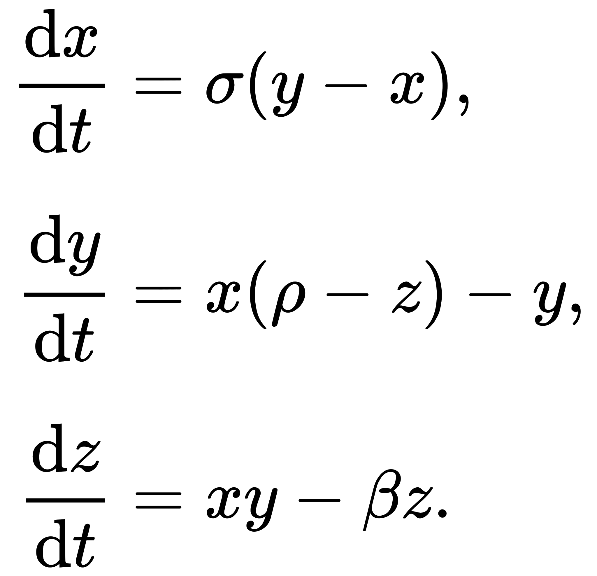
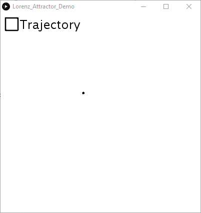
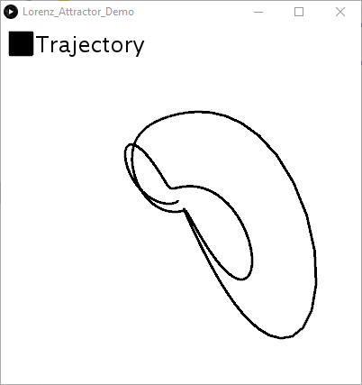
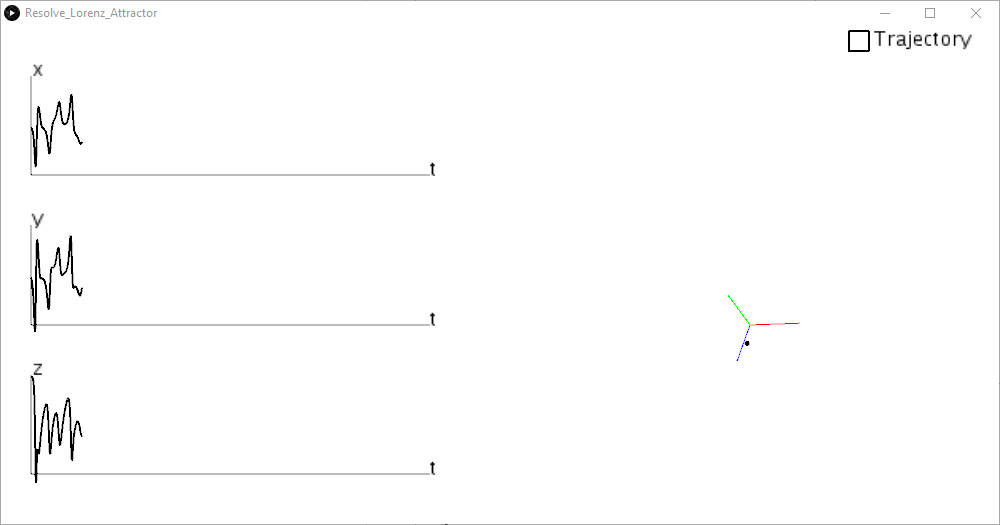
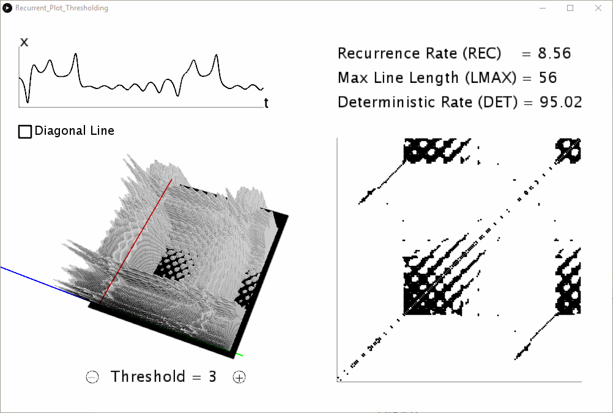
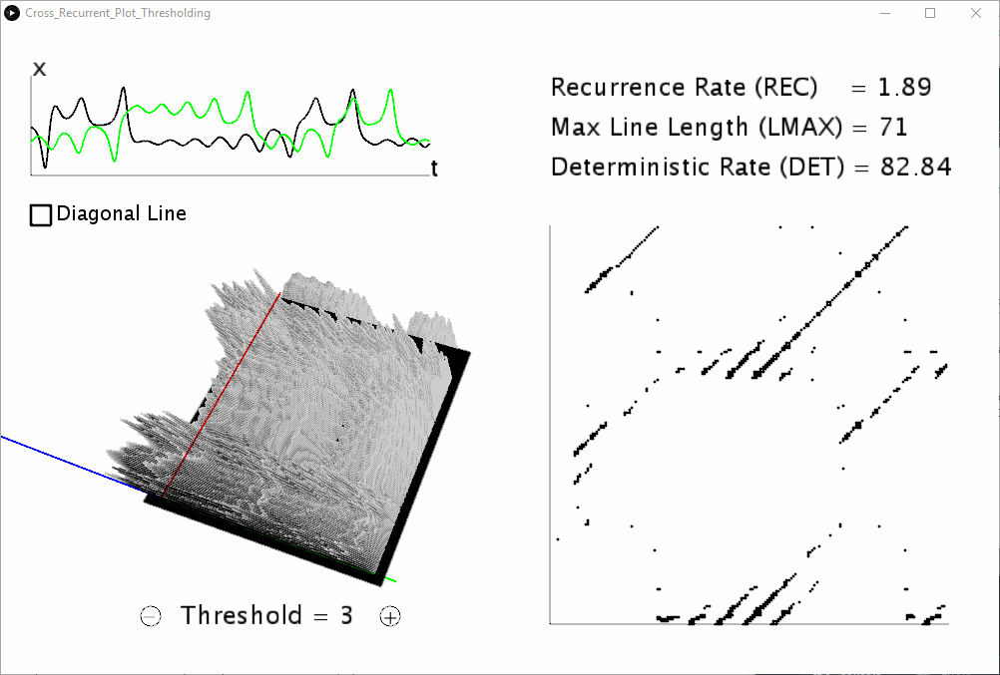

# Visualisation-Cross-Recurrence-Quantification-Analysis

The visualisation is powered by Processing[1].

## Lorenz_Attractor_Demo

In 1963, Edward Lorenz developed a simplified mathematical model for atmospheric convection[2]. The model is a system of three ordinary differential equations now known as the Lorenz equations:

Using the values  =10,  =8/3 and  =28

We got the chaotic motion:

## Resolve_Lorenz_Attractor

We can get the three-dimensional time series.

## Phase_Space_Reconstruction

Assumming that we only have one dimensional time series, we can still reconstruct the movement with time lagged embedding method based on Takens's embedding theory[3].

Here we use Embedding Dimension = 3, Time Lag = 5. The Embedding Dimension can be found with False Nearest Neighhood function. And Time Lag can be found with Average Mutual Information function.

## Recurrent_Plot_Distance

We can calculate the distance between every two points in the trajectory. 

## Recurrent_Plot_Thresholding

By thresholding the distances, we can produce the Recurrent Plot[4,5]. Since we are comparing the motion to itself, the diagonal line ussually should be turned off.

## Cross_Recurrent_Plot_Distance

Cross Recurrence Quantification Analysis takes two time series and calculate the distance between the two time series after the phase space reconstruction of the two time series. It produces Recurrence Rate (REC), Deterministic Rate (DET) and Max Line Length (LMAX), etc. as quantification measurements of the nonlineaer behaviour.

## Cross_Recurrent_Plot_Thresholding

By thresholding the distances, we can produce the Cross Recurrent Plot. Since we are comparing two motions, the diagonal line ussually should be turned on.

## Reference

[1] Reas, C. and Fry, B. Processing: programming for the media arts (2006). Journal AI & Society, volume 20(4), pages 526-538, Springer

[2] Lorenz, Edward Norton (1963). "Deterministic nonperiodic flow". Journal of the Atmospheric Sciences. 20 (2): 130–141. Bibcode:1963JAtS...20..130L. doi:10.1175/1520-0469(1963)020<0130:DNF>2.0.CO;2.

[3] F. Takens (1981). "Detecting strange attractors in turbulence". In D. A. Rand and L.-S. Young (ed.). Dynamical Systems and Turbulence, Lecture Notes in Mathematics, vol. 898. Springer-Verlag. pp. 366–381.

[4] J. P. Eckmann, S. O. Kamphorst, D. Ruelle (1987). "Recurrence Plots of Dynamical Systems". Europhysics Letters. 5 (9): 973–977. Bibcode:1987EL......4..973E. doi:10.1209/0295-5075/4/9/004.

[5] Marwan, N., Romano, M. C., Thiel, M., & Kurths, J. (2007). Recurrence plots for the analysis of complex systems. Physics reports, 438(5-6), 237-329.

 

## Usage:

Dowload Processing from https://processing.org/download/

Install Processing on your computer.

Clone this repository.

Open the visualisation programs in the folder. Play it with Processing.

Program List:
* Lorenz_Attractor_Demo
* Resolve_Lorenz_Attractor
* Phase_Space_Reconstruction
* Recurrent_Plot_Distance
* Recurrent_Plot_Thresholding
* Cross_Recurrent_Plot_Distance
* Cross_Recurrent_Plot_Thresholding

The Recurrence Quantification Analysis(RQA) algorithm is in the Recurrence Quantification Analysis Core folder written in Java. It can be used seperately.

The RQA data should be put in LimitedQueue<Float>. So the first step is to put your time series data to LimitedQueue<Float>.

~~~~
/**LorenzAttractor**/

int size=1000;
float sigma=10f;
float beta=8/3f;
float rho=28f;
float[] xyz = {1f,1f,1f};
float dt=0.01f;

LorenzAttractor lorenz = new LorenzAttractor();
LorenzAttractor lorenz2 = new LorenzAttractor(size);
LorenzAttractor lorenz3 = new LorenzAttractor(xyz,sigma,beta,rho,dt,size);

/**
  * Initiate lorenzAttractor, 
  * lorenz contains the first 1000 points, 
  * lorenz2 contains the 1001-2000 points, 
  * lorenz3 contains the 2001-3000 points.
 **/

for(int i=0;i<size;i++){
    lorenz.run();
    lorenz2.run();lorenz2.run();
    lorenz3.run();lorenz3.run();lorenz3.run();
}

lorenz.getPoint();//float[3];
lorenz.getTrajectory();//LimitedQueue<float[]>

/**Recurrence Quantification Analysis**/

int dim=3,lag=5,radius=3;
boolean on=false;

LimitedQueue<Float> timeSeries = new LimitedQueue<Float>(size);//Initiate data

for(float[] point:lorenz.getTrajectory())
    timeSeries.add(point[0]); //Put the X axis of Lorenz Attractor to the timeSeries.

RecurrentMatrix rm = new RecurrentMatrix(timeSeries, dim, lag, radius);
rm.getDistanceMatirx();//float[][]
rm.getRecurrentMatirx();//float[][]
rm.getRecurrentRate();//float
rm.getLMAX();//int
rm.getDeterminit();//float
rm.setRadius(radius);
rm.diagonal(on);

/**Cross Recurrence Quantification Analysis**/

LimitedQueue<Float> timeSeries2 = new LimitedQueue<Float>(size);

for(float[] point:lorenz2.getTrajectory())
    timeSeries2.add(point[0]);

LimitedQueue<Float> timeSeries3 = new LimitedQueue<Float>(size);

for(float[] point:lorenz3.getTrajectory())
    timeSeries3.add(point[0]);

RecurrentMatrix rm = new RecurrentMatrix(timeSeries2, timeSeries3, dim, lag, radius);
~~~~
